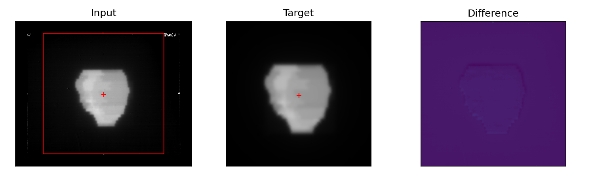

# CentroidRegister

A Python framework for registering two images with known pixel sizes.

The input image is rescaled to have pixel size matching the target.

The images are both thresholded, and the centroids are calculated and aligned.

The final images have matching dimensions and pixel sizes. 

# Example

The identified centroids are shown as plus signs, and the registration bounds are shown in red.

